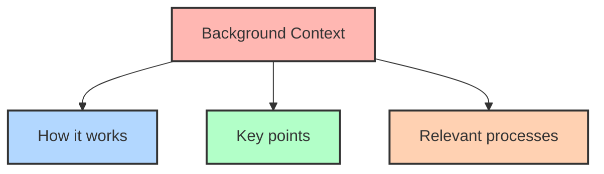

# Conceptual Documentation Template

## Overview

Define **[concept name]**, explaining what it is and why it matters. Give readers a high-level understanding of the concept.

Tell the user **what is it?** Describe the concept in one or two sentences. 

Explain **why is it important?** Benefits?

## Background Context

Explain the history or origin of the concept, including any relevant context:
- How it works
- Key points
- Relevant processes, workflows, etc.

Include diagrams like [MermaidJS](https://mermaid.js.org/) or visuals to help clarify the explanation.

## Use Cases

Present a real-world application, use cases, or scenarios. 

Explain how it solves problems or adds value in specific contexts.

### Use Case 1: [Description]
- **Context**: [Describe the situation or problem]
- **How the concept applies**: [Explain the relevance]

### Use Case 2: [Description]
- **Context**: [Describe the situation or problem]
- **How the concept applies**: [Explain the relevance]

## Common Misconceptions

Address any misunderstandings or myths about the concept. 

Clarify what it does not mean or where it might be misinterpreted.

- **Misconception 1**: [Describe the misunderstanding]
  - **Clarification**: [Explain why it’s incorrect]
- **Misconception 2**: [Describe the misunderstanding]
  - **Clarification**: [Explain why it’s incorrect]

## More Resources

Provide links to related documentation, articles, or other resources for users.

- **Resource 1**: [Link and brief description]
- **Resource 2**: [Link and brief description]

